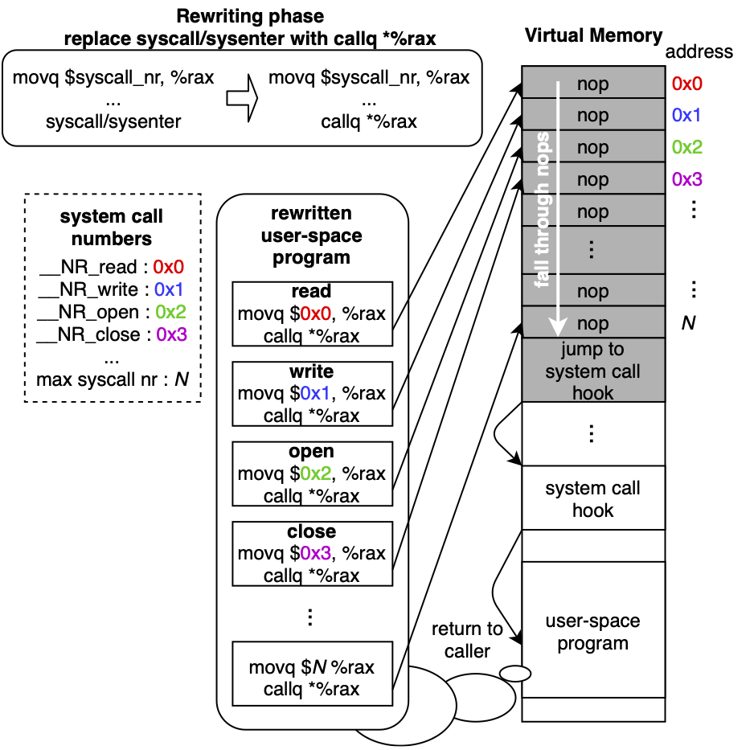

# Supplemental documentation

## The core idea (October 2021)

zpoline is based on binary rewriting; it replaces ```syscall``` and ```sysenter```, which are two-byte instructions (```0x0f 0x05``` and ```0x0f 0x34``` in opcode respectively) that trigger a system call, to jump to an arbitrary hook function address.

### Challenge and Goal

The challenge of this work is that the two-byte space, originally occupied by a ```syscall```/```sysenter``` instruction, is too small to locate a ```jmp```/```call``` instruction along with an arbitrary destination address; typically, two bytes are occupied by the opcode of jmp/call and eight bytes are necessary for a 64-bit absolute address, or another possibility is one byte for a ```jmp```/```call``` instruction and four bytes of a 32-bit relative address. Due to this issue, existing binary rewriting techniques give up the replacement in some cases and fail to ensure exhaustive hooking, exceed the two-byte space originally occupied by ```syscall```/```sysenter``` to put the code bigger than two bytes while a jump to the exceeded part causes unexpected behavior, or take the int3 signaling approach that imposes a significant overhead. The goal of zpoline is to be free from these drawbacks.

### Design

The overview of zpoline is shown below.



**System call and calling convention.** zpoline employs the calling convention of system calls. In UNIX-like systems on x86-64 CPUs, when a user-space program executes ```syscall```/```sysenter```, the context is switched into the kernel, then, a pre-configured system call handler is invoked. To request the kernel to execute a particular system call, a user-space program sets a system call number (e.g., 0 is ```read```, 1 is ```write```, and 2 is ```open``` in Linux on x86-64 CPUs) to the rax register before triggering a system call, and in the kernel, the system call handler executes one of the system calls according to the value of the rax register.

**Binary rewriting.** To hook system calls, zpoline replaces ```syscall```/```sysenter``` with ```callq *%rax``` which is represented by two bytes 0xff 0xd0 in opcode. Since the instruction sizes of ```syscall```/```sysenter``` and ```callq *%rax``` are the same two bytes, the replacement does not break the neighbor instructions. What callq *%rax does is to push the current instruction pointer (the caller’s address) to the stack, and jump to the address stored in the rax register. Our insight is that, according to the calling convention, the rax register always has a system call number. Therefore, the consequence of ```callq *%rax``` is the jump to a virtual address between 0 and the maximum system call number which is more or less 500.

**Trampoline code.** To redirect the execution to a user-defined hook function, zpoline instantiates the trampoline code at virtual address 0; in the trampoline code, the virtual address range between 0 and the maximum system call number is filled with the single-byte ```nop``` instruction (```0x90```), and at the next to the last ```nop``` instruction, a piece of code to jump to a particular hook function is located.

**Execution flow.** After the trampoline code instantiation and binary rewriting are completed, the rewritten part (```callq *%rax```) will jump to one of the ```nop```s in the trampoline code while pushing the caller’s address on the stack. The execution slides down the subsequent ```nop```s; after executing the last ```nop```, it jumps to the hook function. Here, the hook function will have the same register state as the kernel-space system call handler. The return of the hook function jumps back to the caller address that is pushed on the stack by ```callq *%rax```.

## Use of dlmopen (November 2021)

Users of the zpoline technique should pay attention to the use of rewritten functions, otherwise, the system call hook may fall into an infinite loop.

Let's think about the printf library call which internally invokes a write system call.
When zpoline is applied to the user-space program, the write system call triggered in printf will be hooked by zpoline.
The problem occurs when the system call hook calls printf.
It will result in an infinite loop because the write system call in printf, called by the hook function, will be hooked and redirected to the same hook function.

But, in this example, the hook function can use printf.

This is realized by dlmopen. In ```libzpoline.so```, a function named ```load_hook_lib``` calls dlmopen and loads ```apps/basic/libzphook_basic.so```. In particular, ```load_hook_lib``` specifies ```LM_ID_NEWLM``` for dlmopen, and this requests to load ```apps/basic/libzphook_basic.so``` in a new namespace. At the same time, dlmopen also loads other required libraries including libc in the same namespace to which ```apps/basic/libzphook_basic.so``` belongs.

Now, libc for ```apps/basic/libzphook_basic.so``` is newly instantiated in the new namespace, and it is different from the one used by the primary user-space program. Here, ```libzpoline.so``` does not replace syscall and sysenter instructions in the newly instantiated libc. Therefore, the functions implemented in ```apps/basic/libzphook_basic.so``` does not cause an infinite loop.

Note that dlmopen does not only load libc but also other shared libraries associated with the hook function library. The association is done by the compiler. If you forget to specify the library to link (e.g., ```-lpthread``` for libpthread, ```-lm``` for libmath) for the compiler, dlmopen may fail to load them.

## Coping with NULL pointer exceptions (April 2022)

Since zpoline uses address 0, that is normally considered NULL, by default, some NULL pointer errors do not cause a segmentation fault. The current version implements metigations for this issue.

Mainly, we think about three cases, write to NULL, read from NULL, and execute the program at NULL.

### 1. Write to NULL

We wish to cause a segmentation fault when running the following exmaple program.

```c
#include <stdio.h>
#include <string.h>

int main(int argc, char const* argv[])
{
	printf("write 0x90 to NULL\n");

	printf("if memory is properly configured, this causes segfault\n");

	memset(NULL, 0x90, 1);

	printf("memory is not configured!\n");

	return 0;
}
```

The solution for this case is simple. We just use the mprotect system call without specifying PROT_WRITE.

### 2. Read from NULL

The next case is read access to NULL, and the example is shown below.


```c
#include <stdio.h>
#include <string.h>

int main(int argc, char const* argv[])
{
	char c;

	printf("read 1 byte from NULL\n");

	printf("if XOM is properly configured, this causes segfault\n");

	memcpy(&c, NULL, sizeof(c));

	printf("XOM is not configured!\n");

	printf("addr NULL has value : 0x%02x\n", c & 0xff);

	return 0;
}
```

Our solution is using eXecute-Only Memory (XOM). On Linux, when the CPU supports Intel PKU, the mprotect system call, that only specifies PROT_EXEC (meaning PROT_WRITE and PROT_READ are not specified), will configure the specified region as XOM.

So, in summary, in zpoline, the protection aginst NULL read/write can be done by

```
mprotect(NULL, trampoline_code_size, PROT_EXEC);
```

### 3. Execute NULL (Unintentionally)

We wish to trap unintended jump/call to the trampoline code at NULL. The example is below.

```c
#include <stdio.h>

static void (*dummy_function)(long, long, long) = NULL;

int main(int argc, char const* argv[])
{
	printf("call function at NULL\n");

	printf("normally, this causes segfault\n");

	dummy_function(0, 0, 0); // this will be read(0, NULL, 0) for default zpoline

	printf("NULL function is executed\n");

	return 0;
}
```

In zpoline, the address 0 (NULL) has the trampoline code, therefore, we cannot remove the executable flag from it.

What we wish to do here is, to allow only our replaced ```callq *%rax``` to go through the trampoline code, and never allow for the other cases.

Our solution is to
- keep addresses of ```callq *%rax``` that we replaced in the rewriting phase.
- check, at the entry point of the hook function, if the caller comes from our ```callq *%rax```.

This implementation contains this check mechanism in the ifdef section named ```SUPPLEMENTAL__REWRITTEN_ADDR_CHECK```.

## USENIX ATC 2023 reviews Q&A (May 2023)

### How does zpoline compare to DBI tools such as Intel PIN?

We have run an experiment to see the hook overhead of Intel Pin System Call API, whose pointer is provided in the review.

We used pin-3.27-98718-gbeaa5d51e-gcc-linux and implement a simple system call hook program, whose hook function just returns without doing anything, and the hook function is registered with the PIN_AddSyscallEntryFunction API.

We apply this hook program for the getpid benchmark program used in Section 3.2 and we observed 2703 ns for each getpid system call invocation; this number includes the time for the kernel-space getpid system call execution, which is 74 ns on our hardware, therefore, we see the hook overhead of Intel PIN is 2629 ns.

We found that, compared to the overhead of zpoline (41 ns shown in Table 1), Intel PIN's overhead is substantially higher.

### Can the suggestion proposed by anonymous reviwer C reduce the nop overhead?

Context: for reducing the nop overhead in the trampoline code, anonymous reviewer C had proposed to employ the virtual addresses corresponding to deprecated system calls such as epoll_ctl_old and epoll_wait_old for putting short jump rather than nop.

For the experimentation, we have added the following lines in setup_trampoline() to embed a short jump at address 214 (NR_epoll_ctl_old) and 215 (NR_epoll_wait_old); thanks to this approach, we could skip 127 nops (the range of a short jump is -128 to +127 according to the CPU implementation).

```c
        ((uint8_t *) mem)[NR_syscalls + 0xb] = 0xff;
        ((uint8_t *) mem)[NR_syscalls + 0xc] = 0xe0;
 
+       // optimization introduced by reviewer C
+       ((uint8_t *) mem)[214 /* __NR_epoll_ctl_old */] = 0xeb; /* short jmp */
+       ((uint8_t *) mem)[215 /* __NR_epoll_wait_old */] = 127; /* range of a short jmp : -128 ~ +127 */
+
        /*
         * mprotect(PROT_EXEC without PROT_READ), executed
```

We run the same experiment done in Section 3.2 for Table 1, and observed 31 ns as the result; this means the proposed approach reduces the overhead by 24% compared to our zpoline result 41 ns.

***We would like to thank anonymous reviewer C for bringing up this idea.***

### What are the average numbers of nops executed in the benchmarks?

For the implementation used in the experiments, we have statically set the number of nops as 512.

Therefore, in the getpid experiment in Section 3.2, each hook invocation runs through 473 nops (syscall number of getpid is 39; 512 - 39 = 473); since we only run getpid, 473 is the average.

For Section 3.3, we have checked which system calls are triggered in the primary loops of the simple HTTP server and Redis server.

For the benchmarks in Section 3.3, we counted the number of system calls executed in 1 second during the simple HTTP server and Redis server benchmark workload; the following is the results.

(from left, syscall number, name of the syscall, and the number of invocation in 1 second)

Simple HTTP server
- 0   read       : 1185497
- 1   write      : 1185497
- 232 epoll_wait : 1185497

=> ((512 - 0) * 1185497 + (512 - 1) * 1185497 + (512 - 232) * 1185497) / (1185497 + 1185497 + 1185497) = 434; 434 nops is the average in the simple HTTP server case.

Redis
- 0   read       : 665983
- 1   write      : 665973
- 3   close      : 10
- 232 epoll_wait : 665997
- 257 openat     : 10

=> ((512 - 0) * 665983 + (512 - 1) * 665973 + (512 - 3) * 10 + (512 - 232) * 665997 + (512 - 257) * 10) / (665983 + 665973 + 10 + 665997 + 10) = 434; 434 nops is the average for the Redis server case as well.

### How many pages are modified by binary rewriting?

A system can save physical memory consumption by sharing the memory pages, having the code of a user-space program, among different user-space processes that may execute the same code block; however, the pages having rewritten code cannot be shared.

To see how our binary rewriting approach reduces the shareable pages, we counted the number of modified pages for the code of libc that is the primary residence of syscall/sysenter; we found glibc-2.35, loaded on the memory, has 544 syscall/sysenter instructions which are put across 62 of 4~KB pages.

We think this number is acceptable particularly on modern servers typically installing tens or hundreds of gigabytes of DRAM.

## Reducing nop overhead by 0xeb 0x6a 0x90 (May 2023)

For reducing the cost to slide down the nops in the trampoline code, [anonymous reviewer C at USENIX ATC 2023](#can-the-suggestion-proposed-by-anonymous-reviwer-c-reduce-the-nop-overhead) proposed to employ the virtual addresses corresponding to deprecated system calls to embed short jump rather than nop and anonymous reviewer D suggested to instrument the program to make a list of system calls used in the program and put jump instructions at the virtual addresses corresponding to non-used system calls.

This suggestion gave us the inspiration for the enhancement leveraging the short jump instruction; again, we appreciate anonymous reviewer C and D for their suggestions.

After a bit of investigation, we came up with an idea to use 0xeb 0x6a 0x90, rather than full of nops, for sliding down the top part of the trampoline code.

The complicated part is that x86 CPUs consider the instruction starts at the address that the execution jumps to, and the replaced code (```callq *%rax```) can jump to any address between 0 and the maximum system call number; our previous solution was to fill this range with the single-byte nop instruction (0x90), however, it is costly to run through the nops.

The optimization fills the address range from 0 to THE_MAX_SYSCALL_NUMBER - 0x6a (106) - 2 with 0xeb 0x6a 0x90, and the range between THE_MAX_SYSCALL_NUMBER - 0x6a (106) - 1 to THE_MAX_SYSCALL_NUMBER is still filled with nops; the content of the trampoline code will be as follows.
```
 ----------  virtual address ---------- : -- value --
0                                       :    0xeb
1                                       :    0x6a
2                                       :    0x90
                  ...                   : repeat 0xeb 0x6a 0x90
THE_MAX_SYSCALL_NUMBER - 0x6a (106) - 1 :    0x90 (nop)
THE_MAX_SYSCALL_NUMBER - 0x6a (106) - 0 :    0x90 (nop)
                  ...                   : repeat 0x90 (nop)
THE_MAX_SYSCALL_NUMBER                  :    0x90 (nop)
```

The meaning of 0xeb 0x6a 0x90 0xeb 0x6a ... depends on the address that the execution lands at by ```callq *%rax```, and there are three cases: the following shows how x86 CPUs consider the byte sequence in each case.

1. ```0xeb 0x6a``` : jmp 0x6a (the execution lands at n * 3 + 0)
2. ```0x6a 0x90``` : push 0x90 (the execution lands at n * 3 + 1)
3. ```0x90 0xeb 0x6a``` : nop, jmp 0x6a (the execution lands at n * 3 + 2)

Therefore, the trampoline code will be considered as follows.

case 1: land at n * 3 + 0

```asm
jmp 0x6a
nop
jmp 0x6a
nop
...
```

case 2: land at n * 3 + 1

```asm
push 0x90
jmp 0x6a
nop
jmp 0x6a
nop
...
```

case 3: land at n * 3 + 2

```asm
nop
jmp 0x6a
nop
jmp 0x6a
...
```

The thing we need to care about is that case 2 pushes the value 0x90 to the stack; to cope with this, we check the address, we landed at, and discard 0x90 on the stack when we find we come from n * 3 + 1 (case 2).

After we apply this optimization, we run the same experiment done in Section 3.2 for Table 1 of the paper; as a result, we observed 10 ns as the hook overhead and this is 4 times faster than the previous version shown in the paper (41 ns is reported as the hook overhead).

# Other materials

## Hooking system calls with int3 and Syscall User Dispatch (SUD)

To try int3 or Syscall User Dispatch (SUD), please replace the content of ```zpoline/main.c``` with the following program.

```c
#ifndef _GNU_SOURCE
#define _GNU_SOURCE
#endif

#if !defined(MODE_SUD) && !defined(MODE_INT3)
#error "either MODE_SUD or MODE_INT3 has to be defined"
#elif defined(MODE_SUD) && defined(MODE_INT3)
#error "MODE_SUD and MODE_INT3 should not be defined simultaneously"
#endif

#include <stdio.h>
#include <stdint.h>
#include <stdbool.h>
#include <stdlib.h>
#include <errno.h>
#include <assert.h>
#include <signal.h>
#include <sched.h>
#include <sys/syscall.h>
#if defined(MODE_INT3)
#include <string.h>
#include <sys/mman.h>
#include <dis-asm.h>
#elif defined(MODE_SUD)
#include <sys/prctl.h>
#endif

#include <dlfcn.h>

#if defined(MODE_SUD)
static char sud_selector;
extern void syscall_addr_end(void);
#endif
extern void syscall_addr(void);
extern long enter_syscall(int64_t, int64_t, int64_t, int64_t, int64_t, int64_t, int64_t);
extern void asm_syscall_hook(void);

void ____asm_impl(void)
{
	asm volatile (
	".globl enter_syscall \n\t"
	"enter_syscall: \n\t"
	"movq %rdi, %rax \n\t"
	"movq %rsi, %rdi \n\t"
	"movq %rdx, %rsi \n\t"
	"movq %rcx, %rdx \n\t"
	"movq %r8, %r10 \n\t"
	"movq %r9, %r8 \n\t"
	"movq 8(%rsp),%r9 \n\t"
	".globl syscall_addr \n\t"
	"syscall_addr: \n\t"
	"syscall \n\t"
#if defined(MODE_SUD)
	".globl syscall_addr_end \n\t"
	"syscall_addr_end: \n\t"
#endif
	"ret \n\t"
	);

	asm volatile (
	".globl asm_syscall_hook \n\t"
	"asm_syscall_hook: \n\t"
	"cmpq $15, %rax \n\t"
	"je do_rt_sigreturn \n\t"
	"pushq %rbp \n\t"
	"movq %rsp, %rbp \n\t"

	"andq $-16, %rsp \n\t"

	"pushq %r11 \n\t"
	"pushq %r9 \n\t"
	"pushq %r8 \n\t"
	"pushq %rdi \n\t"
	"pushq %rsi \n\t"
	"pushq %rdx \n\t"
	"pushq %rcx \n\t"

	"pushq 8(%rbp) \n\t"
	"pushq %rax \n\t"
	"pushq %r10 \n\t"

	"callq syscall_hook \n\t"

	"popq %r10 \n\t"
	"addq $16, %rsp \n\t"

	"popq %rcx \n\t"
	"popq %rdx \n\t"
	"popq %rsi \n\t"
	"popq %rdi \n\t"
	"popq %r8 \n\t"
	"popq %r9 \n\t"
	"popq %r11 \n\t"

	"movq 8(%rbp), %rcx \n\t"

	"leaveq \n\t"

	"addq $136, %rsp \n\t"
	"jmp *%rcx \n\t"

	"do_rt_sigreturn:"
	"addq $136, %rsp \n\t"
	"jmp syscall_addr \n\t"
	);
}

static long (*hook_fn)(int64_t a1, int64_t a2, int64_t a3,
		       int64_t a4, int64_t a5, int64_t a6,
		       int64_t a7) = enter_syscall;

long syscall_hook(int64_t rdi, int64_t rsi,
		  int64_t rdx, int64_t __rcx __attribute__((unused)),
		  int64_t r8, int64_t r9,
		  int64_t r10_on_stack /* 4th arg for syscall */,
		  int64_t rax_on_stack,
		  int64_t retptr)
{
	/*
	 * XXX: current impelementation of the SIGTRAP/SIGSYS handler
	 * cannot co-exist with a user-defined SIGTRAP/SIGSYS handler.
	 */
	if (rax_on_stack == __NR_rt_sigaction
#if defined(MODE_INT3)
			&& rdi == SIGTRAP
#elif defined(MODE_SUD)
			&& rdi == SIGSYS
#endif
			) {
		return 0;
	}

	if (rax_on_stack == __NR_rt_sigprocmask)
		return 0;

	if (rax_on_stack == __NR_clone3)
		return -ENOSYS;

	if (rax_on_stack == __NR_clone) {
		if (rdi & CLONE_VM) {
			rsi -= sizeof(uint64_t);
			*((uint64_t *) rsi) = retptr;
		}
	}
#if defined(MODE_SUD)
	sud_selector = 0; /* allow */
#endif
	long ret = hook_fn(rax_on_stack, rdi, rsi, rdx, r10_on_stack, r8, r9);
#if defined(MODE_SUD)
	sud_selector = 1; /* block */
#endif
	return ret;
}

#if defined(MODE_INT3)

struct disassembly_state {
	char *code;
	size_t off;
};

#ifdef NEW_DIS_ASM
static int do_rewrite(void *data, enum disassembler_style style ATTRIBUTE_UNUSED, const char *fmt, ...)
#else
static int do_rewrite(void *data, const char *fmt, ...)
#endif
{
	struct disassembly_state *s = (struct disassembly_state *) data;
	char buf[4096];
	va_list arg;
	va_start(arg, fmt);
	vsprintf(buf, fmt, arg);
	if (!strncmp(buf, "syscall", 7) || !strncmp(buf, "sysenter", 8)) {
		uint8_t *ptr = (uint8_t *)(((uintptr_t) s->code) + s->off);
		if ((uintptr_t) ptr == (uintptr_t) syscall_addr)
			goto skip;
		ptr[0] = 0xcc; // int3
		ptr[1] = 0x90; // nop
	}
skip:
	va_end(arg);
	return 0;
}

static void disassemble_and_rewrite(char *code, size_t code_size, int mem_prot)
{
	struct disassembly_state s = { 0 };
	assert(!mprotect(code, code_size, PROT_WRITE | PROT_READ | PROT_EXEC));
	disassemble_info disasm_info = { 0 };
#ifdef NEW_DIS_ASM
	init_disassemble_info(&disasm_info, &s, (fprintf_ftype) printf, do_rewrite);
#else
	init_disassemble_info(&disasm_info, &s, do_rewrite);
#endif
	disasm_info.arch = bfd_arch_i386;
	disasm_info.mach = bfd_mach_x86_64;
	disasm_info.buffer = (bfd_byte *) code;
	disasm_info.buffer_length = code_size;
	disassemble_init_for_target(&disasm_info);
	disassembler_ftype disasm;
	disasm = disassembler(bfd_arch_i386, false, bfd_mach_x86_64, NULL);
	s.code = code;
	while (s.off < code_size)
		s.off += disasm(s.off, &disasm_info);
	assert(!mprotect(code, code_size, mem_prot));
}

static void rewrite_code(void)
{
	FILE *fp;
	assert((fp = fopen("/proc/self/maps", "r")) != NULL);
	{
		char buf[4096];
		while (fgets(buf, sizeof(buf), fp) != NULL) {
			/* we do not touch stack and vsyscall memory */
			if (((strstr(buf, "stack") == NULL) && (strstr(buf, "vsyscall") == NULL))) {
				int i = 0;
				char addr[65] = { 0 };
				char *c = strtok(buf, " ");
				while (c != NULL) {
					switch (i) {
					case 0:
						strncpy(addr, c, sizeof(addr) - 1);
						break;
					case 1:
						{
							int mem_prot = 0;
							{
								size_t j;
								for (j = 0; j < strlen(c); j++) {
									if (c[j] == 'r')
										mem_prot |= PROT_READ;
									if (c[j] == 'w')
										mem_prot |= PROT_WRITE;
									if (c[j] == 'x')
										mem_prot |= PROT_EXEC;
								}
							}
							/* rewrite code if the memory is executable */
							if (mem_prot & PROT_EXEC) {
								size_t k;
								for (k = 0; k < strlen(addr); k++) {
									if (addr[k] == '-') {
										addr[k] = '\0';
										break;
									}
								}
								{
									int64_t from, to;
									from = strtol(&addr[0], NULL, 16);
									if (from == 0)
										break;
									to = strtol(&addr[k + 1], NULL, 16);
									disassemble_and_rewrite((char *) from,
											(size_t) to - from,
											mem_prot);
								}
							}
						}
						break;
					}
					if (i == 1)
						break;
					c = strtok(NULL, " ");
					i++;
				}
			}
		}
	}
	fclose(fp);
}
#endif

static void sig_h(int sig __attribute__((unused)), siginfo_t *si __attribute__((unused)), void *ptr)
{
	ucontext_t *uc = (ucontext_t *) ptr;
	uc->uc_mcontext.gregs[REG_RSP] -= 128;
	uc->uc_mcontext.gregs[REG_RSP] -= sizeof(uint64_t);
#if defined(MODE_INT3)
	*((uint64_t *) (uc->uc_mcontext.gregs[REG_RSP])) = uc->uc_mcontext.gregs[REG_RIP] + 1;
#elif defined(MODE_SUD)
	*((uint64_t *) (uc->uc_mcontext.gregs[REG_RSP])) = uc->uc_mcontext.gregs[REG_RIP];
#endif
	uc->uc_mcontext.gregs[REG_RIP] = (uint64_t) asm_syscall_hook;
	asm volatile(
	"movq $0xf, %rax \n\t"
	"add $0x8, %rsp \n\t"
	"jmp syscall_addr \n\t"
	);
}

static void setup_signal(void)
{
	struct sigaction sa = { 0 };
	sa.sa_flags = SA_SIGINFO | SA_RESTART;
	sa.sa_sigaction = sig_h;
	assert(!sigemptyset(&sa.sa_mask));
	assert(!sigaddset(&sa.sa_mask, SIGTRAP));
#if defined(MODE_INT3)
	assert(!sigaction(SIGTRAP, &sa, NULL));
#elif defined(MODE_SUD)
	assert(!sigaction(SIGSYS, &sa, NULL));

	sud_selector = 0; /* allow */

	assert(!prctl(59 /* set SUD */, 1 /* on */,
				syscall_addr,
				(syscall_addr_end - syscall_addr + 1),
				&sud_selector));

	sud_selector = 1; /* block */
#endif
}

static void load_hook_lib(void)
{
	void *handle;
	{
		const char *filename;
		filename = getenv("LIBZPHOOK");
		if (!filename) {
			fprintf(stderr, "env LIBZPHOOK is empty, so skip to load a hook library\n");
			return;
		}

		handle = dlmopen(LM_ID_NEWLM, filename, RTLD_NOW | RTLD_LOCAL);
		if (!handle) {
			fprintf(stderr, "dlmopen failed: %s\n\n", dlerror());
			fprintf(stderr, "NOTE: this may occur when the compilation of your hook function library misses some specifications in LDFLAGS. or if you are using a C++ compiler, dlmopen may fail to find a symbol, and adding 'extern \"C\"' to the definition may resolve the issue.\n");
			exit(1);
		}
	}
	{
		int (*hook_init)(long, ...);
		hook_init = dlsym(handle, "__hook_init");
		assert(hook_init);
		assert(hook_init(0, &hook_fn) == 0);
	}
}

__attribute__((constructor(0xffff))) static void __zpoline_init(void)
{
	setup_signal();
#if defined(MODE_INT3)
	rewrite_code();
#endif
	load_hook_lib();
}
```

Afterward, please edit ```zpoline/Makefile``` to add either ```-DMODE_INT3``` or ```-DMODE_SUD``` to ```CFLAGS```.
(It is also fine to directly add ```#define MODE_INT3``` or ```#define MODE_SUD``` in the code above.)

If you wish to try int3-based hook, please add the following in ```zpoline/Makefile```.

```
CFLAGS += -DMODE_INT3
```

If you wish to try SUD-based hook, please add the following in ```zpoline/Makefile```.

```
CFLAGS += -DMODE_SUD
```

Then, please compile it by ```make```.

Afterward, supposedly, we can run the same command shown in the How to Use section (https://github.com/yasukata/zpoline#how-to-use) while the system calls are hooked by the signal handler for either SIGTRAP (int3) or SIGSYS (SUD).
